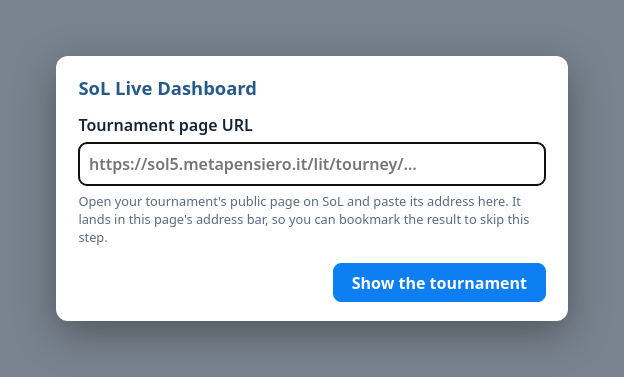
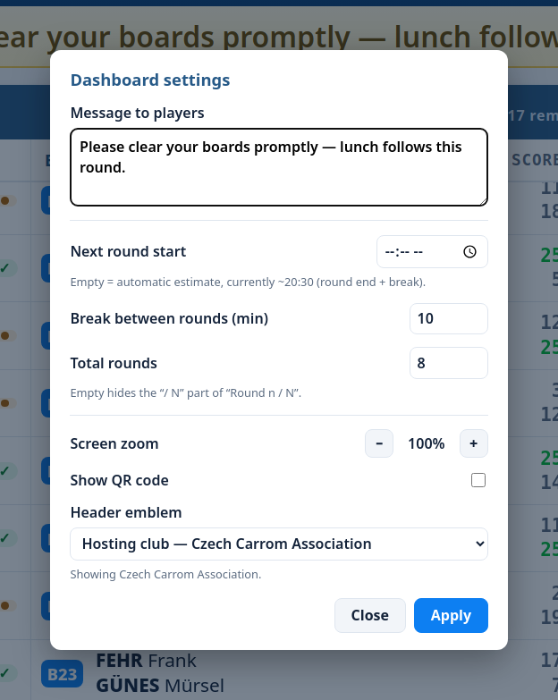

# SoL Live Dashboard

A single HTML file that shows a **live [Scarry On-Line](https://sol5.metapensiero.it/) carrom tournament** on a big
screen — navy header, a large round clock, live boards, and standings. It reads SoL's public tournament pages
directly (clearing the Anubis anti-bot gate in the page itself), so there is **no server, no build, and nothing for
players to install**. Point it at your tournament and put it on a TV.

This README is about **getting it running for your own tournament**. For how the code works, see `CLAUDE.md`.

## Screenshots

<sub>Click any image for the full-size view (opens in a new tab).</sub>

<table>
<tr>
<td width="50%"><a href="screenshots/01-players.png" target="_blank" rel="noopener"></a><br><sub><b>Before the first round</b> — the registered players, until the first pairings are drawn.</sub></td>
<td width="50%"><a href="screenshots/02-round-live.png" target="_blank" rel="noopener"></a><br><sub><b>Round in progress</b> — live boards with scores, the round clock, standings, and a message-to-players banner.</sub></td>
</tr>
<tr>
<td width="50%"><a href="screenshots/03-round-prealarm.png" target="_blank" rel="noopener"></a><br><sub><b>Prealarm</b> — the clock turns amber: no more new boards, finish the ones on the table.</sub></td>
<td width="50%"><a href="screenshots/04-final.png" target="_blank" rel="noopener"></a><br><sub><b>Final</b> — a best-of-three shown as one panel: the series score and every game.</sub></td>
</tr>
</table>

## The dashboard

**<https://ondrejchmelar.github.io/sol-live-dashboard/dashboard.html>** — the current version, published from this
repo. This is the address to hand to the Chrome launch below; you don't have to download anything.

⚠️ **Opening it in an ordinary browser tab will not work.** It will ask for your tournament URL as normal, and then
sit on "Waiting for SoL…" forever, because a normal tab may not read SoL cross-origin. Copy the address into the
launch command in [Step 3](#step-3--launch-it) instead — that's the one catch, explained next.

---

## The one catch: it needs a special Chrome launch

SoL doesn't send CORS headers, so a normal browser tab isn't allowed to *read* SoL's pages from another origin — and
it can't even see the Anubis challenge to solve it. The fix is to open the dashboard in a **throwaway Chrome started
with web security disabled and its own profile directory**. This is safe because that Chrome is disposable and used
only for the dashboard. Every deployment method below ends with this same launch step.

You need Chrome, Chromium, Edge, or Brave. **Firefox has no equivalent flag and will not work.**

---

## Step 1 — Find your tournament URL

Open your tournament's public page on SoL. The address looks like:

```
https://sol5.metapensiero.it/lit/tourney/<GUID>
```

`<GUID>` is the long hex string in the URL. Copy the whole URL — that's all the dashboard needs. Singles vs doubles is
detected automatically, so the same file works for either.

## Step 2 — Get the dashboard file

Either use the [hosted copy](#the-dashboard) as-is, or download `dashboard.html` from this repo (the single file is
the whole app) and save it anywhere, e.g. `~/sol/dashboard.html`. Downloading gets you a copy that can't change under
you mid-tournament; the hosted one is always current. Either way the launch in Step 3 is the same — swap the
`file:///…` path for the `https://…` address if you use the hosted copy.

## Step 3 — Launch it

Replace the path and the `url=` with yours. The `--user-data-dir` is **required** (Chrome ignores
`--disable-web-security` on your normal profile) — point it at any empty throwaway folder.

**Linux**
```
google-chrome --disable-web-security --user-data-dir="/tmp/sol-dash" \
  "file:///home/you/sol/dashboard.html?url=https://sol5.metapensiero.it/lit/tourney/<GUID>"
```

**macOS**
```
"/Applications/Google Chrome.app/Contents/MacOS/Google Chrome" \
  --disable-web-security --user-data-dir="/tmp/sol-dash" \
  "file:///Users/you/sol/dashboard.html?url=https://sol5.metapensiero.it/lit/tourney/<GUID>"
```

**Windows** (one line)
```
chrome.exe --disable-web-security --user-data-dir="%TEMP%\sol-dash" "file:///C:/Users/you/sol/dashboard.html?url=https://sol5.metapensiero.it/lit/tourney/<GUID>"
```

It opens ("Waiting for SoL…"), solves Anubis in the page, and within a few seconds shows your tournament. Press
<kbd>F11</kbd> for fullscreen once it's up. Exit with `Alt+F4` (or `Cmd+Q` on macOS).

**Don't want to edit a query string?** Leave the `?url=…` part off and launch the bare file — the dashboard asks for
the tournament address on screen and you can paste it in:

<p align="center"><a href="screenshots/06-url-prompt.png" target="_blank" rel="noopener"></a></p>

The address you paste ends up in the browser's own address bar, exactly as if you had typed the query string — so you
can bookmark the running dashboard and skip this step next time. Everything else on this page still applies; the
special Chrome launch above is what you can't skip.

---

## Options

Append these to the `?url=…` query string (`&` between them). That's the complete list — the dashboard reads no
other parameters.

- `url=<lit URL>` — the tournament from Step 1. The only one you normally need. Omit it and the dashboard asks for
  the address on screen instead.
- `poll=<seconds>` — how often to refresh (default `60`, minimum `30` — lower values are clamped).
- `rounds=<N>` — total rounds, shown as "Round n / N" (Swiss events don't expose this; default `8`).
- `idt=<idtourney>` — the integer timer id. Normally auto-detected while the round clock runs; only set this if the
  clock never appears. You can read it from a countdown URL, e.g. `…?idtourney=1201`.
- `qr=0` / `qr=1` — force the QR code off entirely, or on past its round-3 auto-hide. Omit for the default
  behaviour. See [QR code](#qr-code-to-the-live-sol-page).
- `logo=<image URL>` — a header logo of your own, overriding the club emblem SoL supplies. See
  [Host association logo](#host-association-logo).

Example: `dashboard.html?url=…/lit/tourney/<GUID>&poll=30&rounds=9&qr=0`

---

## Settings panel (click the logo)

Everything an operator adjusts during the day lives in one panel: **click the logo** in the
top-left. Hovering it shows a small gear so the control is findable; with no pointer on the
screen, the audience just sees the logo.

The panel opens in **its own small window**, which you can drag onto a laptop screen and edit
without the room reading a half-typed announcement off the projector. If the browser blocks the
popup, the same panel falls back to an in-page dialog:

<p align="center"><a href="screenshots/05-settings.png" target="_blank" rel="noopener"></a><br><sub><b>The settings panel</b> — every operator control in one place, here as the in-page dialog over a dimmed live round.</sub></p>

| Setting | Effect |
| --- | --- |
| **Message to players** | Announcement bar under the header. Empty hides the bar. |
| **Next round start** | Manual override for the header's "next round" time. **Leave it empty to keep the automatic estimate** (round end + break) — it is deliberately not pre-filled, so changing some other setting can't freeze the estimate by accident. |
| **Break between rounds** | Feeds that automatic estimate. |
| **Total rounds** | The "/ N" in "Round n / N". Swiss events don't publish this. Empty hides it. |
| **Screen zoom** | Same 5 % steps as the footer control below. |
| **Show QR code** | Hides the QR now, or forces it back after its round-3 auto-hide. |
| **Header emblem** | Which club's emblem to show, or none — see below. |

Text fields apply on **Apply**; zoom and the QR toggle take effect immediately, so you can nudge
them while watching the big screen.

Three ways in, all opening the same panel: the **logo**, the <kbd>Space</kbd> key, or clicking the
part of the header you want to change — the **next-round time** or the **"Round n / N"** subtitle.
<kbd>Esc</kbd> closes it.

---

## Keyboard shortcuts

All of these are plain keys, active anywhere on the dashboard except while typing in a settings
field. <kbd>Ctrl</kbd>/<kbd>Cmd</kbd>-combos are deliberately left alone, so the browser's own
zoom and fullscreen shortcuts still work alongside these.

| Key | Effect |
| --- | --- |
| <kbd>Space</kbd> | Open the settings panel (same as clicking the logo) |
| <kbd>Esc</kbd> | Close the settings panel |
| <kbd>+</kbd> / <kbd>=</kbd> | Zoom in 5 % |
| <kbd>-</kbd> / <kbd>_</kbd> | Zoom out 5 % |
| <kbd>0</kbd> | Reset zoom to 100 % |
| <kbd>F11</kbd> | Toggle the browser's own fullscreen |
| <kbd>Alt</kbd>+<kbd>F4</kbd> (Windows/Linux) / <kbd>Cmd</kbd>+<kbd>Q</kbd> (macOS) | Quit the browser |

There's no keyboard shortcut for scrolling — use the mouse wheel or touch drag instead, see
[Scrolling](#scrolling) below.

---

## Scrolling

Both panels drift up and down on their own so a long field cycles into view. You can also
**scroll either panel by hand** — mouse wheel, or drag on a touchscreen — and the panel you
scroll moves independently of the other. The automatic drift pauses for 10 seconds after you
touch it, then picks up again from wherever you left it, so an unattended screen always returns
to cycling on its own.

---

## Zoom (fitting the screen)

The whole layout is sized in `rem`, so it scales as one piece. Browser zoom works, but its steps
(67 / 75 / 80 / 90 / 100 / 110 %) are too coarse to dial in a particular screen, so the dashboard
has its own **5 % zoom control**: move the mouse over the bottom bar and **− 100 % +** appears in
the middle of it. Click the percentage to reset to 100 %. Keyboard: <kbd>-</kbd>, <kbd>+</kbd>,
<kbd>0</kbd> (plain keys — <kbd>Ctrl</kbd>-combos still drive the browser's own zoom).

The control is invisible until hovered, so nothing shows on an unattended corridor screen. The
setting is remembered per browser profile, and zooming re-flows the layout the same way resizing
does: zoom out and more match/standings columns fit, zoom in and the columns get wider (useful for
long names) or drop to one.

---

## Deployment options

All three end with the **Step 3 launch** — hosting only changes *where the file lives*, not the need for the special
Chrome (the page still fetches SoL cross-origin).

### A. Local file (simplest)
Keep `dashboard.html` on the display machine and launch it as in Step 3. Nothing else to set up.

### B. Bake your URL into the file
So you don't have to pass `?url=` every time, copy the file and hard-code your tournament once:

1. Copy `dashboard.html` to e.g. `mytourney.html`.
2. Open it in a text editor, find `CONFIG` near the top, and set `targetUrl` to your `…/lit/tourney/<GUID>` URL.
3. Launch it without a query string:
   `google-chrome --disable-web-security --user-data-dir="/tmp/sol-dash" "file:///path/mytourney.html"`

Only worth it if you launch the same tournament over and over — otherwise just pass `?url=`.

### C. Host on a web server
Upload `dashboard.html` (or your baked copy) to any static host — e.g. `https://yoursite/dashboard/mytourney.html`
— by FTP or however you publish that site. Then on the display machine launch Chrome pointing at the **hosted URL**
instead of a `file://` path:

```
google-chrome --disable-web-security --user-data-dir="/tmp/sol-dash" \
  "https://yoursite/dashboard/mytourney.html"
```

Hosting is convenient for updating the file centrally and for several screens, but each screen still runs its own
throwaway Chrome with the flags — visiting the URL in a normal browser will not work (CORS).

### Example: the screens this was built for

One copy of the file, the tournament passed in the query string — no separate file per event.
These run the copy published from this repo by GitHub Pages:

- <a href="https://ondrejchmelar.github.io/sol-live-dashboard/dashboard.html?url=https://sol5.metapensiero.it/lit/tourney/a61d130076e211f1b82f901b0edac7fa" target="_blank" rel="noopener">28th Eurocup 2026 in Prague — Singles</a>
- <a href="https://ondrejchmelar.github.io/sol-live-dashboard/dashboard.html?url=https://sol5.metapensiero.it/lit/tourney/5de8f12a76e311f1b059901b0edac7fa" target="_blank" rel="noopener">28th Eurocup 2026 in Prague — Doubles</a>

⚠️ **These are URLs to hand to the Step 3 Chrome launch, not links to browse.** Clicked from an
ordinary tab they show the dashboard's layout but sit on "Waiting for SoL…" forever, because a
normal browser may not read SoL cross-origin — the same CORS wall as everywhere else on this page.
Copy the address and launch it with the flags instead.

---

## Running it unattended

- **Auto-start on boot:** put the launch command in the OS autostart (a `.desktop` autostart entry or systemd user
  service on Linux, a Startup shortcut on Windows). A fresh `--user-data-dir` each boot is fine.
- **Fullscreen:** press <kbd>F11</kbd> once the dashboard is up.
- **Keep the screen awake:** disable sleep/screensaver on the display machine.
- **Weak/laptop GPUs:** the dashboard is tuned to stay light on CPU (discrete-step pulsing, GPU-composited scrolling),
  so it runs comfortably unattended for hours.
- The Anubis clearance cookie lasts ~7 days, and the page re-solves automatically if it expires, so a long run is fine.

---

## QR code to the live SoL page

A small QR code floats in the bottom-right corner, linking to the configured SoL URL so
people nearby can pull up the official page on their own phone. It's only useful early on
(before players know where to find it themselves), so it **auto-hides from round 3 on**.
Before that, you can also dismiss it early:

- Click the QR box on the dashboard itself.
- Untick **Show QR code** in the settings panel, which can also bring it back after the
  round-3 auto-hide.

Either way it lasts the session only. To settle it before launch, relaunch with `&qr=0` to
force it off entirely, or `&qr=1` to force it on past round 3. QR rendering uses a vendored
copy of [qrcode-generator](https://github.com/kazuhikoarase/qrcode-generator) (MIT), inlined
so the file stays dependency-free.

## Host association logo

The header's top-left icon shows the **hosting club's emblem from SoL, automatically** —
no configuration. The dashboard reads the tournament's **"Hosted by"** club and picks up
that club's emblem, once per tournament.

Worth knowing *why* it's the "Hosted by" club: SoL records two clubs per tournament. **"Club"**
owns the championship, **"Hosted by"** is the association actually running the event — and the
emblem printed on the tournament page is the *former*. At the 2026 Eurocup that page shows the
European Carrom Confederation, while the organiser is the Czech Carrom Association. So the
dashboard follows the "Hosted by" link to that club's own page and takes the emblem from there,
falling back to the championship club, then to the plain board icon.

**Header emblem** in the settings panel picks between them, naming the actual clubs so you
don't have to remember which is which:

| Option | Shows |
| --- | --- |
| **Hosting club** (default) | e.g. "Hosting club — Czech Carrom Association" |
| **Championship owner** | e.g. "Championship owner — European Carrom Confederation" |
| **None — board icon** | The bundled placeholder |

Both are looked up once and kept, so switching is instant. "None" is there because SoL accepts
whatever image a club uploaded — emblems come in different formats (`.bmp` and `.png` both
occur) and arbitrary aspect ratios — so if one looks wrong blown up on a 4K header, switch it
off. The choice is remembered.

To override it entirely — a sponsor, or a local-club logo that isn't in SoL — pass
**`&logo=<image URL>`** in the launch URL; it wins over everything. If an image is unset or
fails to load, the default board icon is shown.

---

## Notes & limits

- **Anubis.** The gate is solved in the page, and that works today — but Anubis is third-party anti-bot software, so
  an update to its puzzle could in principle break the solver. The symptom would be the dashboard sitting on
  "Reconnecting to SoL…" forever.
- **Pre-round timer.** While a round is being *prepared*, SoL exposes no way to know how much break time remains:
  the pre-round countdown runs entirely in the operator's own browser — the page simply counts down from the full
  duration whenever it loads, and the server never learns when the break actually started. Any number the dashboard
  showed would be fabricated, so the header just says "Preparing the …round" without a countdown; a live clock
  appears once the round starts. Making that timer shareable would take a rewrite on SoL's side (a server-side
  anchor for it), not something this dashboard can work around.
- **Firefox is not supported** — it has no `--disable-web-security` equivalent.
- This is an operator/display tool; players never install anything.
