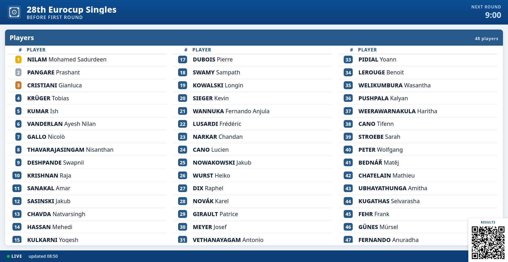
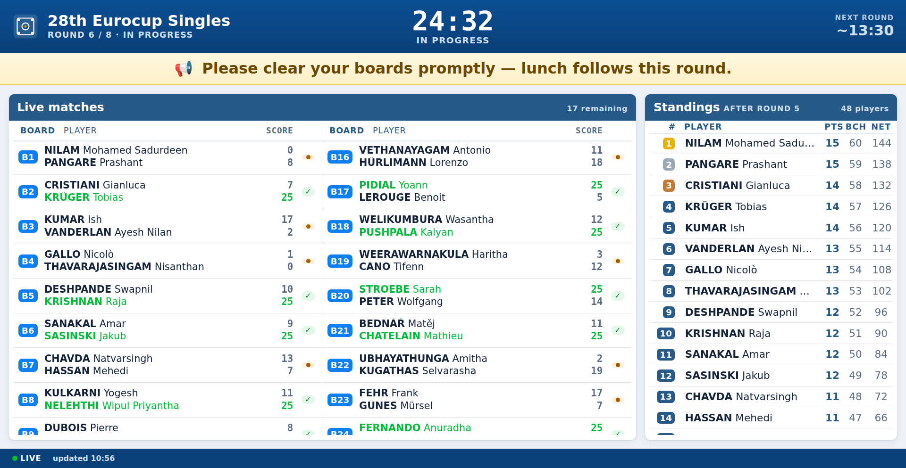
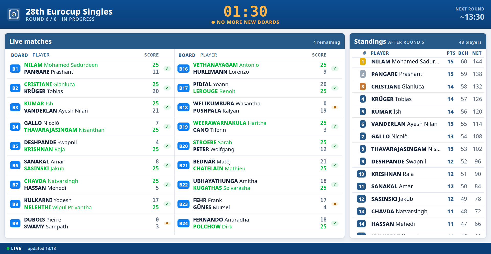
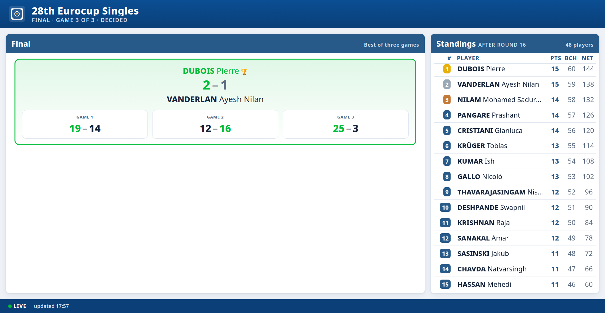

# SoL Live Dashboard

A single HTML file that shows a **live [Scarry On-Line](https://sol5.metapensiero.it/) carrom tournament** on a big
screen — navy header, a large round clock, live boards, and standings. It reads SoL's public tournament pages
directly (clearing the Anubis anti-bot gate in the page itself), so there is **no server, no build, and nothing for
players to install**. Point it at your tournament and put it on a TV.

This README is about **getting it running for your own tournament**. For how the code works, see `CLAUDE.md`.

## Screenshots

<sub>Click any image for the full-size view.</sub>

<table>
<tr>
<td width="50%"><a href="screenshots/01-players.png"></a><br><sub><b>Before the first round</b> — the registered players, until the first pairings are drawn.</sub></td>
<td width="50%"><a href="screenshots/02-round-live.png"></a><br><sub><b>Round in progress</b> — live boards with scores, the round clock, and standings.</sub></td>
</tr>
<tr>
<td width="50%"><a href="screenshots/03-round-prealarm.png"></a><br><sub><b>Prealarm</b> — the clock turns amber: no more new boards, finish the ones on the table.</sub></td>
<td width="50%"><a href="screenshots/04-final.png"></a><br><sub><b>Final</b> — a best-of-three shown as one panel: the series score and every game.</sub></td>
</tr>
</table>

---

## The one catch: it needs a special Chrome launch

SoL doesn't send CORS headers, so a normal browser tab isn't allowed to *read* SoL's pages from another origin — and
it can't even see the Anubis challenge to solve it. The fix is to open the dashboard in a **throwaway Chrome started
with web security disabled and its own profile directory**. This is safe because that Chrome is disposable and used
only for the dashboard. Every deployment method below ends with this same launch step.

You need Chrome, Chromium, Edge, or Brave. **Firefox has no equivalent flag and will not work.**

---

## Step 1 — Find your tournament URL

Open your tournament's public page on SoL. The address looks like:

```
https://sol5.metapensiero.it/lit/tourney/<GUID>
```

`<GUID>` is the long hex string in the URL. Copy the whole URL — that's all the dashboard needs. Singles vs doubles is
detected automatically, so the same file works for either.

## Step 2 — Get the dashboard file

Download `standalone.html` from this repo (the single file is the whole app). Save it anywhere, e.g.
`~/sol/standalone.html`.

## Step 3 — Launch it

Replace the path and the `url=` with yours. The `--user-data-dir` is **required** (Chrome ignores
`--disable-web-security` on your normal profile) — point it at any empty throwaway folder.

**Linux**
```
google-chrome --disable-web-security --user-data-dir="/tmp/sol-dash" \
  "file:///home/you/sol/standalone.html?url=https://sol5.metapensiero.it/lit/tourney/<GUID>"
```

**macOS**
```
"/Applications/Google Chrome.app/Contents/MacOS/Google Chrome" \
  --disable-web-security --user-data-dir="/tmp/sol-dash" \
  "file:///Users/you/sol/standalone.html?url=https://sol5.metapensiero.it/lit/tourney/<GUID>"
```

**Windows** (one line)
```
chrome.exe --disable-web-security --user-data-dir="%TEMP%\sol-dash" "file:///C:/Users/you/sol/standalone.html?url=https://sol5.metapensiero.it/lit/tourney/<GUID>"
```

It opens ("Waiting for SoL…"), solves Anubis in the page, and within a few seconds shows your tournament. Press
<kbd>F11</kbd> for fullscreen once it's up. Exit with `Alt+F4` (or `Cmd+Q` on macOS).

---

## Options

Append these to the `?url=…` query string (`&` between them):

- `poll=<seconds>` — how often to refresh (default `60`, minimum `30`).
- `rounds=<N>` — total rounds, shown as "Round n / N" (Swiss events don't expose this; default `8`).
- `idt=<idtourney>` — the integer timer id. Normally auto-detected while the round clock runs; only set this if the
  clock never appears. You can read it from a countdown URL, e.g. `…?idtourney=1201`.

Example: `standalone.html?url=…/lit/tourney/<GUID>&poll=30&rounds=9`

---

## Settings panel (click the logo)

Everything an operator adjusts during the day lives in one panel: **click the logo** in the
top-left. Hovering it shows a small gear so the control is findable; with no pointer on the
screen, the audience just sees the logo.

The panel opens in **its own small window**, which you can drag onto a laptop screen and edit
without the room reading a half-typed announcement off the projector. If the browser blocks the
popup, the same panel falls back to an in-page dialog.

| Setting | Effect |
| --- | --- |
| **Message to players** | Announcement bar under the header. Empty hides the bar. |
| **Next round start** | Manual override for the header's "next round" time. **Leave it empty to keep the automatic estimate** (round end + break) — it is deliberately not pre-filled, so changing some other setting can't freeze the estimate by accident. |
| **Break between rounds** | Feeds that automatic estimate. |
| **Total rounds** | The "/ N" in "Round n / N". Swiss events don't publish this. Empty hides it. |
| **Screen zoom** | Same 5 % steps as the footer control below. |
| **Show QR code** | Hides the QR now, or forces it back after its round-3 auto-hide. |
| **Header emblem** | Which club's emblem to show, or none — see below. |

Text fields apply on **Apply**; zoom and the QR toggle take effect immediately, so you can nudge
them while watching the big screen.

Three ways in, all opening the same panel: the **logo**, the <kbd>Space</kbd> key, or clicking the
part of the header you want to change — the **next-round time** or the **"Round n / N"** subtitle.
<kbd>Esc</kbd> closes it.

---

## Zoom (fitting the screen)

The whole layout is sized in `rem`, so it scales as one piece. Browser zoom works, but its steps
(67 / 75 / 80 / 90 / 100 / 110 %) are too coarse to dial in a particular screen, so the dashboard
has its own **5 % zoom control**: move the mouse over the bottom bar and **− 100 % +** appears in
the middle of it. Click the percentage to reset to 100 %. Keyboard: <kbd>-</kbd>, <kbd>+</kbd>,
<kbd>0</kbd> (plain keys — <kbd>Ctrl</kbd>-combos still drive the browser's own zoom).

The control is invisible until hovered, so nothing shows on an unattended corridor screen. The
setting is remembered per browser profile, and zooming re-flows the layout the same way resizing
does: zoom out and more match/standings columns fit, zoom in and the columns get wider (useful for
long names) or drop to one.

---

## Deployment options

All three end with the **Step 3 launch** — hosting only changes *where the file lives*, not the need for the special
Chrome (the page still fetches SoL cross-origin).

### A. Local file (simplest)
Keep `standalone.html` on the display machine and launch it as in Step 3. Nothing else to set up.

### B. Bake your URL into the file
So you don't have to pass `?url=` every time, copy the file and hard-code your tournament once:

1. Copy `standalone.html` to e.g. `mytourney.html`.
2. Open it in a text editor, find `CONFIG` near the top, and set `targetUrl` to your `…/lit/tourney/<GUID>` URL.
3. Launch it without a query string:
   `google-chrome --disable-web-security --user-data-dir="/tmp/sol-dash" "file:///path/mytourney.html"`

(The shipped `standalone-singles.html` / `standalone-doubles.html` are exactly this — copies with a specific
tournament baked in.)

### C. Host on a web server
Upload `standalone.html` (or your baked copy) to any static host — e.g. `https://yoursite/dashboard/mytourney.html`
— by FTP or however you publish that site. Then on the display machine launch Chrome pointing at the **hosted URL**
instead of a `file://` path:

```
google-chrome --disable-web-security --user-data-dir="/tmp/sol-dash" \
  "https://yoursite/dashboard/mytourney.html"
```

Hosting is convenient for updating the file centrally and for several screens, but each screen still runs its own
throwaway Chrome with the flags — visiting the URL in a normal browser will not work (CORS).

---

## Running it unattended

- **Auto-start on boot:** put the launch command in the OS autostart (a `.desktop` autostart entry or systemd user
  service on Linux, a Startup shortcut on Windows). A fresh `--user-data-dir` each boot is fine.
- **Fullscreen:** press <kbd>F11</kbd> once the dashboard is up.
- **Keep the screen awake:** disable sleep/screensaver on the display machine.
- **Weak/laptop GPUs:** the dashboard is tuned to stay light on CPU (discrete-step pulsing, GPU-composited scrolling),
  so it runs comfortably unattended for hours.
- The Anubis clearance cookie lasts ~7 days, and the page re-solves automatically if it expires, so a long run is fine.

---

## If the dashboard can't get past Anubis

The in-page Anubis solver works today, but Anubis is third-party anti-bot software and an update could change its
puzzle. If the dashboard gets stuck on "Reconnecting to SoL…", use the **Chrome extension** in this repo as a
fallback: it runs Anubis's own code in a real browser tab, so it can't break on Anubis logic changes.

1. `chrome://extensions` → enable **Developer mode** → **Load unpacked** → select this repo folder.
2. Extension **Options** → set your `…/lit/tourney/<GUID>` URL.
3. Open that SoL URL once in a normal tab so the browser solves Anubis.
4. Extension popup → **Start polling** → **Open dashboard**.

Same dashboard, same data — just a different way through the gate.

---

## QR code to the live SoL page

A small QR code floats in the bottom-right corner, linking to the configured SoL URL so
people nearby can pull up the official page on their own phone. It's only useful early on
(before players know where to find it themselves), so it **auto-hides from round 3 on**.
Before that, you can also dismiss it early:

- Click the QR box on the dashboard itself.
- Untick **Show QR code** in the settings panel (`standalone.html`), which can also bring it
  back after the round-3 auto-hide.
- Toggle **Hide QR on dashboard** in the extension popup.

Both write the same `showQR` setting (`chrome.storage.local`), so either one sticks.
In `standalone.html` (no `chrome.storage`), it's session-only: click to hide, or relaunch
with `&qr=0` to force it off entirely, or `&qr=1` to force it on past round 3.
QR rendering uses a vendored copy of
[qrcode-generator](https://github.com/kazuhikoarase/qrcode-generator) (MIT) — `src/qrcode.js`
for the extension, inlined in `standalone.html` to keep that file dependency-free.

## Host association logo

The header's top-left icon shows the **hosting club's emblem from SoL, automatically** —
no configuration. `standalone.html` reads the tournament's **"Hosted by"** club and picks up
that club's emblem, once per tournament.

Worth knowing *why* it's the "Hosted by" club: SoL records two clubs per tournament. **"Club"**
owns the championship, **"Hosted by"** is the association actually running the event — and the
emblem printed on the tournament page is the *former*. At the 2026 Eurocup that page shows the
European Carrom Confederation, while the organiser is the Czech Carrom Association. So the
dashboard follows the "Hosted by" link to that club's own page and takes the emblem from there,
falling back to the championship club, then to the plain board icon.

**Header emblem** in the settings panel picks between them, naming the actual clubs so you
don't have to remember which is which:

| Option | Shows |
| --- | --- |
| **Hosting club** (default) | e.g. "Hosting club — Czech Carrom Association" |
| **Championship owner** | e.g. "Championship owner — European Carrom Confederation" |
| **None — board icon** | The bundled placeholder |

Both are looked up once and kept, so switching is instant. "None" is there because SoL accepts
whatever image a club uploaded — emblems come in different formats (`.bmp` and `.png` both
occur) and arbitrary aspect ratios — so if one looks wrong blown up on a 4K header, switch it
off. The choice is remembered.

Also:

- **`&logo=<image URL>`** in the launch URL wins over everything — use it for a sponsor or a
  local-club logo that isn't in SoL.
- **Extension:** Options → **Branding** → pick an image (stored locally as a data URL, under
  ~500 KB recommended). **Remove** reverts to the default icon. The extension does **not**
  auto-detect the emblem — that's `standalone.html` only.

If an image is unset or fails to load, the default board icon is shown.

---

## Notes & limits

- **One field per file.** Singles and doubles are separate SoL tournaments; run one dashboard per tournament URL.
- **Pre-round timer.** While a round is being *prepared*, SoL exposes no way to know how much break time remains, so
  the header just says "Preparing the …round" without a countdown. A live clock appears once the round starts.
- **Firefox is not supported** — it has no `--disable-web-security` equivalent.
- This is an operator/display tool; players never install anything.
